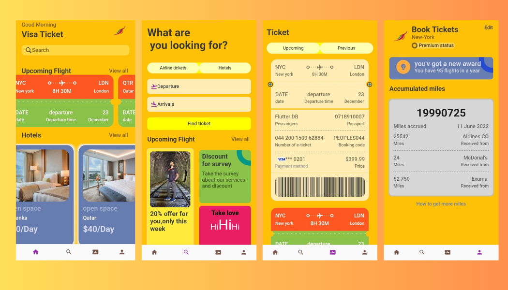

# ✈️🍽️ Restaurant and Flight Booking System

Welcome to the **Restaurant and Flight Booking System**! This app combines the best of travel and dining into one seamless experience, allowing users to book flights and reserve restaurants with ease.

---

## 🚀 Features

- **Flight Booking**: Search and book flights with detailed information about departure and arrival.
- **Hotel Reservations**: Browse and book hotels with a clean, modern interface.
- **Accrued Miles Tracking**: Keep track of your travel miles and rewards.
- **User-Friendly Interface**: Easy navigation for both flight and hotel booking.
- **Dynamic Offers**: Get discounts and special offers.

---

## 📸 Screenshots

### 🌟 Home Page

### 🔍 Search for Flights

### 🛏️ Book Hotels

### 🎟️ Flight Ticket Details

### 📊 Accrued Miles

*More screenshots can be found in the `/screenshots` directory.*

---

## 🛠️ Installation and Setup

### Prerequisites
1. [Node.js](https://nodejs.org/) and npm installed.
2. A modern browser for testing.

# daytask

A new Flutter project.

## Getting Started

This project is a starting point for a Flutter application.

A few resources to get you started if this is your first Flutter project:

- [Lab: Write your first Flutter app](https://docs.flutter.dev/get-started/codelab)
- [Cookbook: Useful Flutter samples](https://docs.flutter.dev/cookbook)

For help getting started with Flutter development, view the
[online documentation](https://docs.flutter.dev/), which offers tutorials,
samples, guidance on mobile development, and a full API reference.
